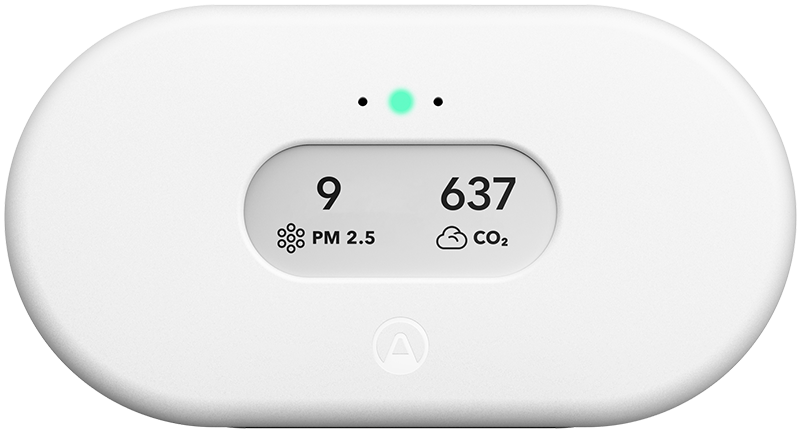
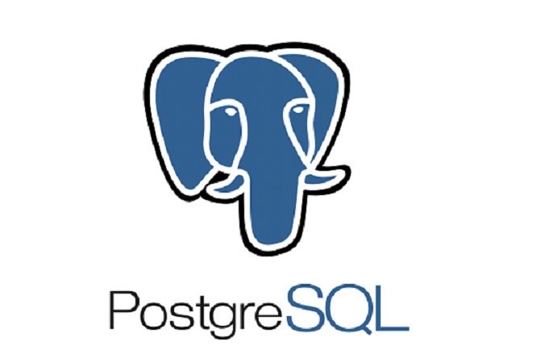

This is mainly a demo of a CI/CD pipeline, but the core script merely queries the Airthings API periodically and inserts the response into Postgres.

We will use GitHub actions to automatically build and push the Docker image upon a commit; the Kubernetes cluster should see the change in the DockerHub container registry and automatically pull the latest image from there. 